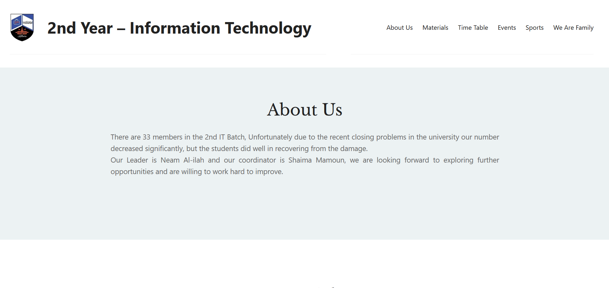

# 2nd Year Information Technology – WordPress Website

  

## Project
This is a small website I made using **WordPress** for a university assignment.  
The idea of the website is to present some information about the **2nd Year Information Technology batch** and show things related to our studies and activities.

The site includes some basic pages like information about the batch, the subjects we study, our weekly timetable, and some events and sports activities in the university.

## Website Content
The website contains a few sections:

- **About Us** – talks about the 2nd IT batch and mentions the batch leader (Neam Al-ilah) and the coordinator (Shaima Mamoun).
- **Materials** – shows some of the subjects studied such as:
  - Fundamentals of Programming (Java and OOP basics)
  - File Management
  - Digital Circuits
  - Principles of Management
  - Principles of Economy
  - New Information Technology
- **Time Table** – a simple weekly schedule of classes.
- **Events** – mentions activities like Pi Day, chess challenges, and some workshops.
- **Sports** – sports available for students like football, basketball and volleyball.
- **We Are Family** – a small section about friendships between students and supporting each other during university.

## Purpose
The purpose of the assignment was mainly to practice:

- building a basic **WordPress website**
- organizing content into pages
- presenting information in a simple website layout

## Tools Used
- WordPress
